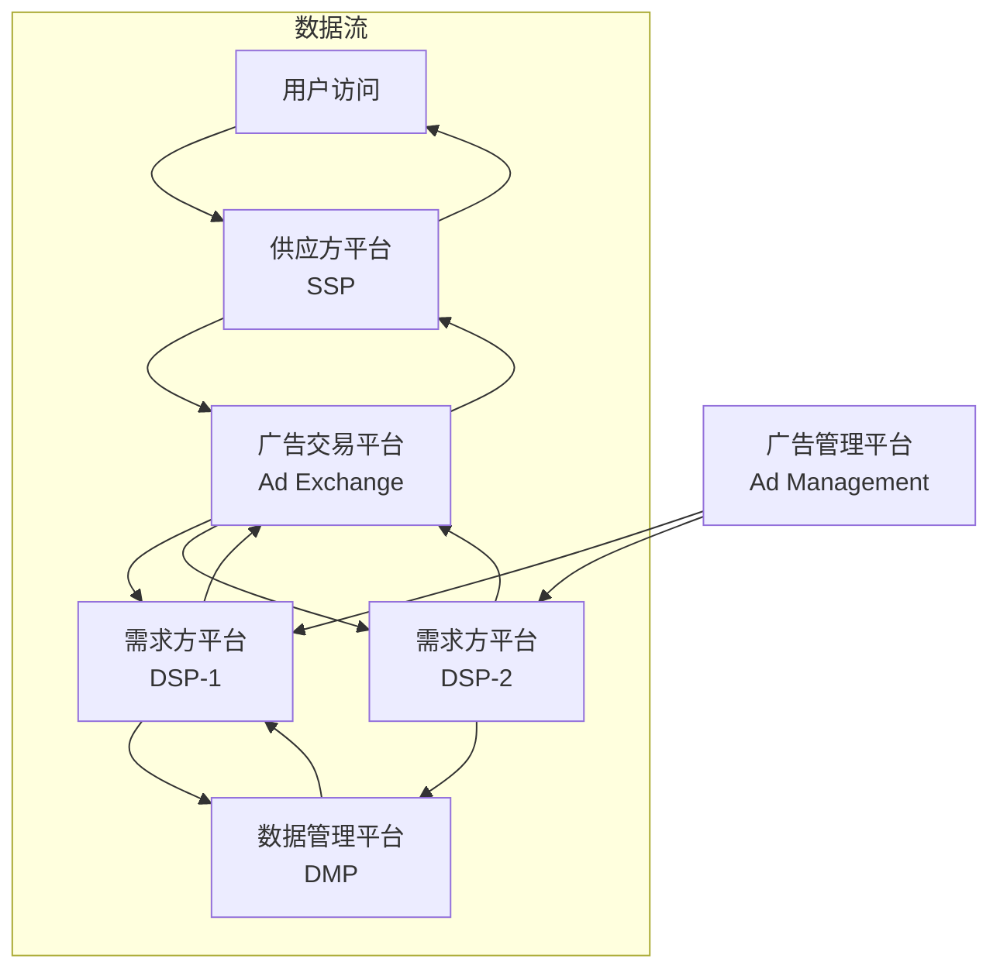

# 设计文档

## 概述

本设计文档描述了一个互联网广告系统架构示意项目的技术实现方案。该系统采用微服务架构，包含五个核心组件：广告管理平台(Ad Management)、需求方平台(DSP)、供应方平台(SSP)、广告交易平台(Ad Exchange)和数据管理平台(DMP)。每个组件都是独立的FastAPI服务，通过RESTful API进行通信，并能够演示完整的实时竞价(RTB)工作流程。

## 架构

### 系统架构图



### 技术栈

- **Web框架**: FastAPI (Python)
- **包管理**: uv
- **数据存储**: SQLite (简单演示用)
- **API通信**: RESTful HTTP APIs
- **数据格式**: JSON
- **日志**: Python logging + 控制台输出

### 服务端口分配

- Ad Management: 8001
- DSP: 8002
- SSP: 8003  
- Ad Exchange: 8004
- DMP: 8005

## 组件和接口

### 1. 广告管理平台 (Ad Management)

**职责**: 管理广告活动、创意和预算

**核心接口**:
```python
POST /campaigns - 创建广告活动
GET /campaigns/{id} - 获取广告活动详情
PUT /campaigns/{id} - 更新广告活动
GET /campaigns/{id}/stats - 获取活动统计数据
GET /health - 健康检查
```

**关键功能**:
- 广告活动CRUD操作
- 预算管理和监控
- 定向条件设置
- 统计数据聚合

### 2. 需求方平台 (DSP)

**职责**: 代表广告主参与实时竞价

**核心接口**:
```python
POST /bid - 接收竞价请求并返回出价
GET /campaigns - 获取关联的广告活动
POST /win-notice - 接收竞价成功通知
GET /stats - 获取竞价统计数据
GET /health - 健康检查
```

**关键功能**:
- 实时竞价决策算法
- 用户画像匹配
- 预算控制和频次限制
- 竞价历史记录

### 3. 供应方平台 (SSP)

**职责**: 为媒体方管理广告位并最大化收益

**核心接口**:
```python
POST /ad-request - 处理广告请求
GET /inventory - 获取广告位库存
GET /revenue - 获取收益报表
POST /impression - 记录广告展示
GET /health - 健康检查
```

**关键功能**:
- 广告位管理
- 收益优化算法
- 展示数据统计
- 媒体方报表生成

### 4. 广告交易平台 (Ad Exchange)

**职责**: 连接DSP和SSP，执行实时竞价

**核心接口**:
```python
POST /rtb - 处理实时竞价请求
GET /auction/{id} - 获取竞价详情
GET /stats - 获取交易统计
POST /demo/rtb-flow - 演示完整RTB流程
GET /health - 健康检查
```

**关键功能**:
- 竞价请求路由
- 竞价评估和排序
- 交易记录和费用计算
- RTB流程编排

### 5. 数据管理平台 (DMP)

**职责**: 管理用户数据和画像

**核心接口**:
```python
GET /user/{id}/profile - 获取用户画像
POST /user/{id}/events - 记录用户行为
PUT /user/{id}/profile - 更新用户画像
GET /segments - 获取用户分群
GET /health - 健康检查
```

**关键功能**:
- 用户画像构建
- 行为数据收集
- 用户分群管理
- 数据清理和保留策略

## 数据模型

### 广告活动 (Campaign)
```python
class Campaign:
    id: str
    name: str
    advertiser_id: str
    budget: float
    spent: float
    targeting: dict
    creative: dict
    status: str
    created_at: datetime
    updated_at: datetime
```

### 用户画像 (UserProfile)
```python
class UserProfile:
    user_id: str
    demographics: dict  # 年龄、性别、地域等
    interests: list     # 兴趣标签
    behaviors: list     # 行为标签
    segments: list      # 所属分群
    last_updated: datetime
```

### 竞价请求 (BidRequest)
```python
class BidRequest:
    id: str
    user_id: str
    ad_slot: dict      # 广告位信息
    device: dict       # 设备信息
    geo: dict          # 地理位置
    timestamp: datetime
```

### 竞价响应 (BidResponse)
```python
class BidResponse:
    request_id: str
    price: float
    creative: dict
    campaign_id: str
    dsp_id: str
```

### 展示记录 (Impression)
```python
class Impression:
    id: str
    campaign_id: str
    user_id: str
    price: float
    timestamp: datetime
    revenue: float
```

## 错误处理

### 错误响应格式
```python
class ErrorResponse:
    error_code: str
    message: str
    details: dict
    timestamp: datetime
```

### 常见错误类型
- `INVALID_REQUEST`: 请求参数无效
- `BUDGET_EXCEEDED`: 预算不足
- `TIMEOUT`: 请求超时
- `SERVICE_UNAVAILABLE`: 服务不可用
- `DATA_NOT_FOUND`: 数据未找到

### 重试机制
- 网络错误: 指数退避重试，最多3次
- 超时错误: 立即返回，记录日志
- 服务错误: 根据错误类型决定是否重试

## 测试策略

### 单元测试
- 每个服务的核心业务逻辑
- 数据模型验证
- API端点功能测试
- 错误处理测试

### 集成测试
- 服务间API通信
- 完整RTB流程测试
- 数据一致性验证
- 性能基准测试

### 测试数据
- 模拟用户画像数据
- 示例广告活动配置
- 测试竞价场景
- 边界条件测试用例

## RTB工作流程设计

### 流程步骤

1. **用户访问模拟**
   - 生成随机用户ID和访问上下文
   - 模拟媒体页面访问事件

2. **SSP广告请求**
   - 构建广告请求对象
   - 包含用户信息和广告位规格
   - 发送到Ad Exchange

3. **Ad Exchange竞价协调**
   - 接收SSP请求
   - 并行向所有DSP发送竞价请求
   - 设置100ms超时限制

4. **DSP竞价决策**
   - 查询DMP获取用户画像
   - 匹配广告活动定向条件
   - 计算出价并返回响应

5. **竞价评估和选择**
   - Ad Exchange收集所有DSP响应
   - 按价格排序选择获胜者
   - 返回获胜广告给SSP

6. **广告展示确认**
   - SSP接收获胜广告
   - 模拟广告展示
   - 记录展示数据

7. **数据反馈循环**
   - 更新各平台统计数据
   - 记录用户行为到DMP
   - 更新预算消耗

### 性能要求
- 总流程时间: < 100ms
- DSP响应时间: < 50ms
- Ad Exchange处理时间: < 30ms
- 并发处理能力: 支持多个同时进行的竞价

### 日志和监控
- 每个步骤的详细控制台输出
- 性能指标记录
- 错误和异常跟踪
- 业务指标统计