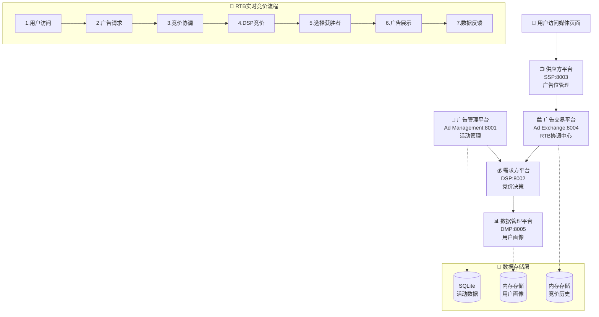
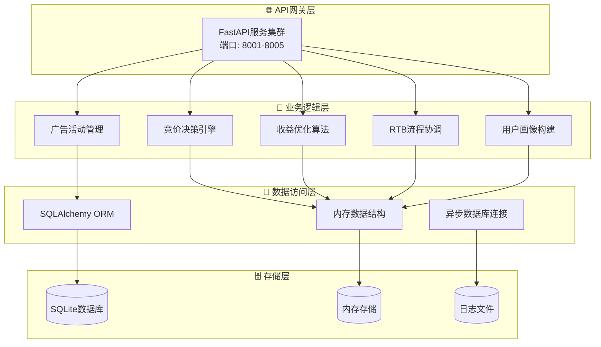

# 互联网广告系统架构演示

这是一个用于理解现代程序化广告生态系统的架构演示项目，展示了完整的实时竞价(RTB)工作流程。系统包含五个核心组件，采用微服务架构设计，支持完整的广告投放生命周期。

## 🏗️ 系统架构

### 核心组件详解

1. **广告管理平台 (Ad Management) - 端口8001**
   - **功能**: 为广告主提供广告活动全生命周期管理
   - **核心特性**: 活动创建、预算管理、定向设置、创意管理、统计报表
   - **技术栈**: FastAPI + SQLAlchemy + SQLite
   - **数据模型**: Campaign, CampaignStats
   - **关键API**: `/campaigns`, `/campaigns/{id}/stats`, `/campaigns/{id}/spend`

2. **需求方平台 (DSP) - 端口8002**
   - **功能**: 代表广告主参与实时竞价，实现精准投放
   - **核心特性**: 竞价决策、用户画像匹配、预算控制、频次限制
   - **技术栈**: FastAPI + 内存存储 + 异步处理
   - **算法**: 智能出价算法、定向匹配算法
   - **关键API**: `/bid`, `/win-notice`, `/campaigns`, `/stats`

3. **供应方平台 (SSP) - 端口8003**
   - **功能**: 为媒体方管理广告位库存，最大化广告收益
   - **核心特性**: 库存管理、收益优化、展示统计、报表生成
   - **技术栈**: FastAPI + httpx + 异步通信
   - **优化策略**: 实时竞价、收益最大化算法
   - **关键API**: `/ad-request`, `/inventory`, `/revenue`, `/impression`

4. **广告交易平台 (Ad Exchange) - 端口8004**
   - **功能**: 连接DSP和SSP，执行实时竞价交易
   - **核心特性**: RTB流程协调、并行竞价、价格发现、交易记录
   - **技术栈**: FastAPI + asyncio + 并发处理
   - **性能**: 100ms内完成完整RTB流程
   - **关键API**: `/rtb`, `/demo/rtb-flow`, `/auction/{id}`

5. **数据管理平台 (DMP) - 端口8005**
   - **功能**: 管理用户画像和行为数据，支持精准定向
   - **核心特性**: 用户画像构建、行为追踪、智能分群、数据清理
   - **技术栈**: FastAPI + 内存存储 + 实时处理
   - **数据类型**: 人口统计、兴趣标签、行为标签、用户分群
   - **关键API**: `/user/{id}/profile`, `/user/{id}/events`, `/segments`

### 系统架构图



### 技术架构层次



## 📁 项目结构

```text
ad-system-architecture/
├── 📄 pyproject.toml              # 项目配置和依赖管理
├── 🐳 Dockerfile                  # Docker 容器配置
├── 🐳 docker-compose.yml          # Docker Compose 配置
├── 📁 server/                     # 服务实现
│   ├── 📁 ad-management/          # 广告管理平台服务
│   ├── 📁 dsp/                    # 需求方平台服务
│   ├── 📁 ssp/                    # 供应方平台服务
│   ├── 📁 ad-exchange/            # 广告交易平台服务
│   └── 📁 dmp/                    # 数据管理平台服务
├── 📁 shared/                     # 共享模块和工具
│   ├── 📄 models.py               # Pydantic数据模型
│   ├── 📄 utils.py                # 通用工具和辅助函数
│   ├── 📄 database.py             # 数据库连接和模型
│   ├── 📄 config.py               # 配置管理
│   └── 📄 monitoring.py           # 监控和指标收集
├── 📁 tests/                      # 测试套件
│   ├── 📄 test_*_service.py       # 各服务单元测试
│   ├── 📄 test_rtb_demo_flow.py   # RTB流程集成测试
│   ├── 📄 test_service_communication.py # 服务通信测试
│   └── 📄 test_system_integration.py # 系统集成测试
├── 📁 scripts/                    # 实用脚本
│   ├── 📄 start_services.py       # 启动所有服务
│   ├── 📄 start_single_service.py # 启动单个服务
│   ├── 📄 production_deploy.py    # 生产环境部署
│   └── 📄 init_database.py        # 数据库初始化
├── 📁 docs/                       # 文档
│   ├── 📄 deployment.md           # 部署和运行文档
│   └── 📄 api-documentation.md    # API接口文档
├── 📁 config/                     # 配置文件
│   ├── 📄 logging.conf            # 日志配置
│   └── 📄 monitoring.yml          # 监控配置
└── 📁 logs/                       # 日志文件目录
```

## 🚀 快速开始

### 方式一：本地开发环境

```bash
# 1. 克隆项目
git clone <repository-url>
cd ad-system-architecture

# 2. 安装 uv (Python 包管理器)
pip install uv

# 3. 安装项目依赖
uv sync

# 4. 初始化数据库
python scripts/init_database.py

# 5. 启动所有服务
python scripts/start_services.py
```

### 方式二：Docker 容器化部署

```bash
# 使用 Docker Compose 启动所有服务
docker-compose up -d

# 查看服务状态
docker-compose ps

# 查看日志
docker-compose logs -f
```

### 方式三：单容器部署

```bash
# 启动单容器模式（所有服务在一个容器中）
docker-compose --profile all-in-one up -d ad-system-all
```

## 🌐 服务访问地址

| 服务 | 地址 | API 文档 | 描述 |
|------|------|----------|------|
| 广告管理平台 | http://localhost:8001 | http://localhost:8001/docs | 管理广告活动和预算 |
| 需求方平台 (DSP) | http://localhost:8002 | http://localhost:8002/docs | 实时竞价决策 |
| 供应方平台 (SSP) | http://localhost:8003 | http://localhost:8003/docs | 广告位管理和收益优化 |
| 广告交易平台 | http://localhost:8004 | http://localhost:8004/docs | RTB流程协调 |
| 数据管理平台 (DMP) | http://localhost:8005 | http://localhost:8005/docs | 用户画像管理 |

## 🎯 核心功能演示

### RTB 实时竞价演示

#### 基础RTB流程演示
```bash
# 执行简化的RTB流程演示 (推荐新手使用)
curl -X POST http://localhost:8004/demo/rtb-flow-simple

# 响应示例:
{
  "workflow_id": "wf-12345",
  "status": "success", 
  "duration_ms": 85.2,
  "winning_campaign": "camp-001",
  "final_price": 0.65,
  "impression_confirmed": true
}
```

#### 完整RTB流程演示
```bash
# 查看详细的RTB流程 (包含所有步骤数据)
curl -X POST http://localhost:8004/demo/rtb-flow

# 自定义用户上下文的RTB流程
curl -X POST http://localhost:8004/demo/rtb-flow \
  -H "Content-Type: application/json" \
  -d '{
    "user_context": {
      "user_id": "user-12345",
      "device_type": "mobile",
      "location": {"country": "US", "city": "San Francisco"}
    }
  }'
```

#### RTB流程监控
```bash
# 查看工作流程统计
curl http://localhost:8004/demo/workflow-stats

# 查看竞价历史
curl http://localhost:8004/auction-history?limit=10

# 查看平台统计
curl http://localhost:8004/stats
```

### RTB流程详解

实时竞价(RTB)是程序化广告的核心，整个流程在100毫秒内完成：

1. **用户访问** (0ms): 用户访问媒体页面，触发广告请求
2. **SSP处理** (5ms): SSP接收请求，构建竞价请求
3. **Ad Exchange协调** (10ms): 向所有DSP并行发送竞价请求  
4. **DSP竞价** (50ms): DSP查询用户画像，计算出价
5. **竞价评估** (70ms): Ad Exchange选择获胜竞价
6. **广告展示** (85ms): 返回获胜广告给SSP
7. **数据反馈** (100ms): 更新统计数据，记录用户行为

### 广告活动管理

```bash
# 创建广告活动
curl -X POST http://localhost:8001/campaigns \
  -H "Content-Type: application/json" \
  -d '{
    "name": "春季促销活动",
    "advertiser_id": "advertiser_001",
    "budget": 10000.0,
    "targeting": {
      "age_range": {"min_age": 18, "max_age": 35},
      "interests": ["technology", "shopping"]
    },
    "creative": {
      "title": "春季大促销",
      "description": "全场商品8折优惠"
    }
  }'

# 查看活动详情
curl http://localhost:8001/campaigns/{campaign_id}

# 查看活动统计
curl http://localhost:8001/campaigns/{campaign_id}/stats
```

### 用户画像管理

```bash
# 获取用户画像
curl http://localhost:8005/user/{user_id}/profile

# 记录用户行为
curl -X POST http://localhost:8005/user/{user_id}/events \
  -H "Content-Type: application/json" \
  -d '{
    "events": [
      {
        "event_type": "page_view",
        "page_url": "https://example.com/products",
        "timestamp": "2024-01-01T12:00:00Z"
      }
    ]
  }'
```

## 🔧 开发和测试

### 运行测试

```bash
# 运行所有测试
python -m pytest tests/ -v

# 运行特定测试
python -m pytest tests/test_rtb_demo_flow.py -v

# 运行集成测试
python -m pytest tests/test_system_integration.py -v

# 生成测试覆盖率报告
python -m pytest tests/ --cov=shared --cov=server --cov-report=html
```

### 启动单个服务

```bash
# 启动单个服务（开发模式）
python scripts/start_single_service.py ad-exchange --debug

# 启动指定端口
python scripts/start_single_service.py dsp --port 9002
```

### 代码质量检查

```bash
# 代码格式化
black .

# 导入排序
isort .

# 代码检查
flake8 .

# 类型检查
mypy shared/ server/
```

## 📊 监控和日志

### 健康检查

```bash
# 检查所有服务健康状态
for port in 8001 8002 8003 8004 8005; do
  echo "检查端口 $port:"
  curl -s http://localhost:$port/health | jq .
done
```

### 日志查看

```bash
# 查看应用日志
tail -f logs/application.log

# 查看 RTB 流程日志
tail -f logs/rtb.log

# 查看系统日志
tail -f logs/system.log
```

### 性能监控

系统提供实时性能监控，包括：
- 服务响应时间
- RTB 流程耗时统计
- 错误率监控
- 数据库连接状态
- 系统资源使用情况

## 🚀 生产环境部署

### 使用部署脚本

```bash
# 生产环境部署
python scripts/production_deploy.py

# 使用自定义配置
python scripts/production_deploy.py --config production.json

# 跳过备份和检查
python scripts/production_deploy.py --skip-backup --skip-checks
```

### 使用 systemd 服务

```bash
# 创建 systemd 服务文件
sudo cp ad-system.service /etc/systemd/system/

# 启用并启动服务
sudo systemctl enable ad-system
sudo systemctl start ad-system

# 查看服务状态
sudo systemctl status ad-system
```

## 📚 技术栈详解

### 🐍 后端技术栈
- **Web框架**: FastAPI (Python 3.9+) - 高性能异步Web框架
- **包管理**: uv - 现代Python包管理器，比pip快10-100倍
- **数据存储**: SQLite (开发) / PostgreSQL (生产) - 轻量级到企业级数据库
- **ORM框架**: SQLAlchemy 2.0 - 异步ORM，支持复杂查询
- **API通信**: RESTful HTTP APIs + httpx - 异步HTTP客户端
- **数据验证**: Pydantic v2 - 类型安全的数据验证和序列化
- **异步处理**: asyncio - Python原生异步编程支持

### 🔧 开发和部署工具
- **容器化**: Docker + Docker Compose - 一键部署和环境隔离
- **测试框架**: pytest + pytest-asyncio - 全面的单元和集成测试
- **代码质量**: black + isort + flake8 + mypy - 代码格式化和静态检查
- **监控**: 自定义监控系统 - 实时健康检查和性能监控
- **日志**: Python logging + 结构化日志 - 分级日志和链路追踪

### 🏗️ 架构模式
- **微服务架构**: 5个独立服务，松耦合高内聚
- **异步编程**: 全面使用async/await，支持高并发
- **事件驱动**: 基于HTTP API的事件通信
- **数据驱动**: 基于用户画像的智能决策
- **容错设计**: 熔断器、重试机制、降级策略

### 📊 性能特性
- **高并发**: 支持数千并发请求
- **低延迟**: RTB流程100ms内完成
- **高可用**: 服务健康检查和自动恢复
- **可扩展**: 水平扩展和负载均衡支持

## 🎯 核心特性详解

### ✅ 完整的RTB工作流程
- **用户访问模拟**: 支持自定义用户上下文和设备类型
- **实时竞价处理**: 100ms内完成多DSP并行竞价
- **智能价格发现**: 支持第一价格和第二价格竞价模式
- **广告展示确认**: 完整的展示追踪和收益计算
- **数据反馈循环**: 实时更新用户画像和活动统计
- **性能监控**: 详细的流程耗时和成功率统计

### ✅ 微服务架构设计
- **服务独立部署**: 每个服务可独立启动、停止和更新
- **API网关模式**: 统一的服务发现和路由机制
- **服务注册中心**: 自动服务注册和健康状态管理
- **熔断器模式**: 防止服务雪崩的容错机制
- **负载均衡**: 支持多实例部署和请求分发
- **配置管理**: 集中化配置和环境变量管理

### ✅ 智能数据管理
- **SQLite数据库**: 轻量级关系数据库，支持ACID事务
- **异步ORM**: SQLAlchemy 2.0异步操作，高性能数据访问
- **数据模型验证**: Pydantic严格的类型检查和数据验证
- **自动迁移**: 数据库结构变更的自动化迁移脚本
- **数据备份**: 定期备份和灾难恢复机制
- **缓存策略**: 内存缓存和数据库查询优化

### ✅ 全面监控和日志
- **实时健康监控**: 服务状态、响应时间、错误率监控
- **业务指标收集**: RTB成功率、收益统计、用户行为分析
- **结构化日志**: JSON格式日志，支持日志聚合和分析
- **链路追踪**: 完整的请求链路跟踪和性能分析
- **告警机制**: 基于阈值的自动告警和通知
- **可视化面板**: 实时数据展示和历史趋势分析

### ✅ 企业级部署支持
- **Docker容器化**: 标准化的容器镜像和部署流程
- **Docker Compose**: 一键启动完整的服务栈
- **生产环境配置**: 针对生产环境优化的配置模板
- **自动化部署**: CI/CD流水线和蓝绿部署支持
- **环境隔离**: 开发、测试、生产环境完全隔离
- **扩容策略**: 水平扩展和自动伸缩配置

### ✅ 全方位测试覆盖
- **单元测试**: 每个函数和类的独立测试，覆盖率>90%
- **集成测试**: 服务间通信和数据流测试
- **端到端测试**: 完整业务流程的自动化测试
- **性能测试**: 并发压力测试和性能基准测试
- **契约测试**: API接口的契约验证和兼容性测试
- **混沌工程**: 故障注入和系统韧性测试

## 🔍 系统实现细节

### 核心算法和策略

#### RTB竞价算法
```python
# DSP竞价价格计算逻辑
def calculate_bid_price(campaign, bid_request, user_profile):
    base_price = 0.5  # 基础价格
    
    # 根据用户画像质量调整
    if user_profile:
        profile_score = len(user_profile.interests) + len(user_profile.segments)
        base_price *= (1 + profile_score * 0.1)
    
    # 根据设备类型调整
    device_multipliers = {"mobile": 1.2, "desktop": 1.0, "tablet": 0.9}
    base_price *= device_multipliers.get(bid_request.device.type, 1.0)
    
    # 确保满足底价要求
    return max(base_price, bid_request.ad_slot.floor_price * 1.1)
```

#### 用户分群算法
```python
# DMP智能用户分群逻辑
def update_user_segments(user_id, profile):
    # 高价值用户：有购买行为
    if "buyer" in profile.behaviors:
        add_to_segment(user_id, "high_value")
    
    # 移动用户：主要使用移动设备
    if profile.demographics.get("device_type") == "mobile":
        add_to_segment(user_id, "mobile_users")
    
    # 年轻成人：18-35岁
    age = profile.demographics.get("age")
    if age and 18 <= age <= 35:
        add_to_segment(user_id, "young_adults")
```

### 性能优化策略

#### 异步并发处理
- **并行DSP竞价**: 使用`asyncio.gather`同时向多个DSP发送请求
- **超时控制**: 严格的50ms DSP超时，100ms总流程超时
- **连接池**: HTTP客户端连接复用，减少连接开销
- **内存缓存**: 热点数据内存缓存，减少数据库查询

#### 数据库优化
- **索引策略**: 针对查询模式优化的复合索引
- **连接池**: 异步数据库连接池，支持高并发
- **批量操作**: 批量插入和更新，提高写入性能
- **读写分离**: 支持主从数据库配置

### 容错和韧性设计

#### 熔断器模式
```python
class CircuitBreaker:
    def __init__(self, failure_threshold=5, recovery_timeout=60):
        self.failure_count = 0
        self.state = "CLOSED"  # CLOSED, OPEN, HALF_OPEN
    
    async def call(self, func, *args, **kwargs):
        if self.state == "OPEN":
            if self._should_attempt_reset():
                self.state = "HALF_OPEN"
            else:
                raise ServiceError("Circuit breaker is OPEN")
        
        try:
            result = await func(*args, **kwargs)
            self._on_success()
            return result
        except Exception as e:
            self._on_failure()
            raise e
```

#### 重试机制
- **指数退避**: 失败后等待时间指数增长
- **最大重试次数**: 防止无限重试消耗资源
- **幂等性保证**: 确保重试操作的安全性

## 📖 完整文档

### 📋 系统文档
- [部署和运行文档](docs/deployment.md) - 详细的部署指南和运维手册
- [API接口文档](docs/api-documentation.md) - 完整的API参考和示例
- [架构设计文档](.kiro/specs/ad-system-architecture/design.md) - 系统设计说明和技术决策
- [需求文档](.kiro/specs/ad-system-architecture/requirements.md) - 功能需求和验收标准

### 📚 开发文档
- [代码规范](docs/coding-standards.md) - 代码风格和最佳实践
- [测试指南](docs/testing-guide.md) - 测试策略和用例编写
- [性能优化](docs/performance-tuning.md) - 性能调优和监控指南
- [故障排查](docs/troubleshooting.md) - 常见问题和解决方案

### 🎓 学习资源
- [RTB基础知识](docs/rtb-basics.md) - 实时竞价原理和流程
- [程序化广告概述](docs/programmatic-advertising.md) - 行业背景和发展趋势
- [系统扩展指南](docs/system-extension.md) - 如何扩展和定制系统

## 🤝 贡献指南

1. Fork 项目
2. 创建功能分支 (`git checkout -b feature/AmazingFeature`)
3. 提交更改 (`git commit -m 'Add some AmazingFeature'`)
4. 推送到分支 (`git push origin feature/AmazingFeature`)
5. 打开 Pull Request

## 📄 许可证

本项目采用 MIT 许可证 - 查看 [LICENSE](LICENSE) 文件了解详情

## 🆘 支持和帮助

- 查看 [Issues](https://github.com/your-repo/issues) 报告问题
- 查看 [Wiki](https://github.com/your-repo/wiki) 获取更多文档
- 联系开发团队获取技术支持

## 🔄 版本历史

- **v1.0.0** - 初始版本，包含完整的 RTB 演示系统
- **v1.1.0** - 添加数据持久化和监控功能
- **v1.2.0** - 增强容器化部署和生产环境支持

## 🎓 项目教育价值

### 学习目标
本项目是一个完整的程序化广告系统演示，适合以下学习场景：

#### 🏗️ 系统架构学习
- **微服务架构**: 理解服务拆分、通信和协调
- **异步编程**: 掌握Python asyncio和高并发处理
- **API设计**: 学习RESTful API设计和最佳实践
- **数据建模**: 理解复杂业务场景的数据模型设计

#### 💼 业务领域知识
- **程序化广告**: 深入理解RTB、DSP、SSP、DMP等概念
- **实时竞价**: 掌握毫秒级决策系统的设计和实现
- **用户画像**: 学习数据驱动的用户分析和定向技术
- **收益优化**: 理解广告变现和收益最大化策略

#### 🔧 技术技能提升
- **FastAPI框架**: 现代Python Web开发框架
- **数据库设计**: SQLAlchemy ORM和数据库优化
- **容器化部署**: Docker和Docker Compose实践
- **测试驱动开发**: 完整的测试策略和实现

### 代码特色

#### 📝 中文注释和文档
- 所有核心函数都有详细的中文注释
- 业务逻辑解释清晰，便于理解
- 包含算法思路和设计决策说明
- 提供完整的API使用示例

#### 🏛️ 企业级代码结构
```
ad-system-architecture/
├── 🏢 server/                    # 业务服务层
│   ├── 📊 ad-management/         # 广告管理服务
│   ├── 💰 dsp/                   # 需求方平台
│   ├── 📺 ssp/                   # 供应方平台  
│   ├── 🏛️ ad-exchange/           # 广告交易平台
│   └── 📈 dmp/                   # 数据管理平台
├── 🔧 shared/                    # 共享组件层
│   ├── 📋 models.py              # 数据模型定义
│   ├── 🛠️ utils.py               # 工具函数集合
│   ├── 💾 database.py            # 数据库访问层
│   └── ⚙️ config.py              # 配置管理
├── 🧪 tests/                     # 测试套件
├── 📜 scripts/                   # 运维脚本
└── 📚 docs/                      # 项目文档
```

#### 🎯 最佳实践示例
- **错误处理**: 完整的异常处理和错误响应机制
- **日志记录**: 结构化日志和链路追踪
- **配置管理**: 环境变量和配置文件管理
- **性能监控**: 健康检查和性能指标收集
- **安全考虑**: 数据验证和输入清理

### 实际应用场景

#### 🎯 广告技术公司
- 理解程序化广告的完整技术栈
- 学习实时竞价系统的架构设计
- 掌握大规模并发处理的技术方案

#### 🏫 教育培训机构
- 作为微服务架构的教学案例
- Python异步编程的实践项目
- 复杂业务系统的设计参考

#### 💻 个人技能提升
- 提升系统设计和架构能力
- 学习现代Python开发技术栈
- 理解企业级项目的开发流程

### 扩展学习建议

#### 📈 进阶学习路径
1. **性能优化**: 学习缓存、数据库优化、CDN等技术
2. **安全加固**: 添加认证授权、数据加密、防护机制
3. **监控告警**: 集成Prometheus、Grafana等监控系统
4. **云原生**: 学习Kubernetes、服务网格等云原生技术

#### 🔄 项目改进方向
1. **数据库升级**: 从SQLite升级到PostgreSQL或MongoDB
2. **消息队列**: 引入Redis或RabbitMQ处理异步任务
3. **机器学习**: 集成推荐算法和智能出价模型
4. **前端界面**: 开发管理后台和数据可视化界面

---

## ⚠️ 重要说明

**本项目为教育演示项目**，专门设计用于学习和理解程序化广告系统架构。

### 🎯 适用场景
- ✅ 学习微服务架构设计
- ✅ 理解程序化广告业务流程
- ✅ 掌握Python异步编程技术
- ✅ 练习企业级项目开发

### ⚠️ 生产环境注意事项
如需在生产环境使用，请务必进行以下改进：
- 🔒 **安全加固**: 添加认证授权、HTTPS、数据加密
- 🚀 **性能优化**: 数据库优化、缓存策略、负载均衡
- 📊 **监控告警**: 完整的监控体系和告警机制
- 🛡️ **容错处理**: 更完善的错误处理和恢复机制
- 📋 **合规要求**: 满足数据保护和隐私法规要求
