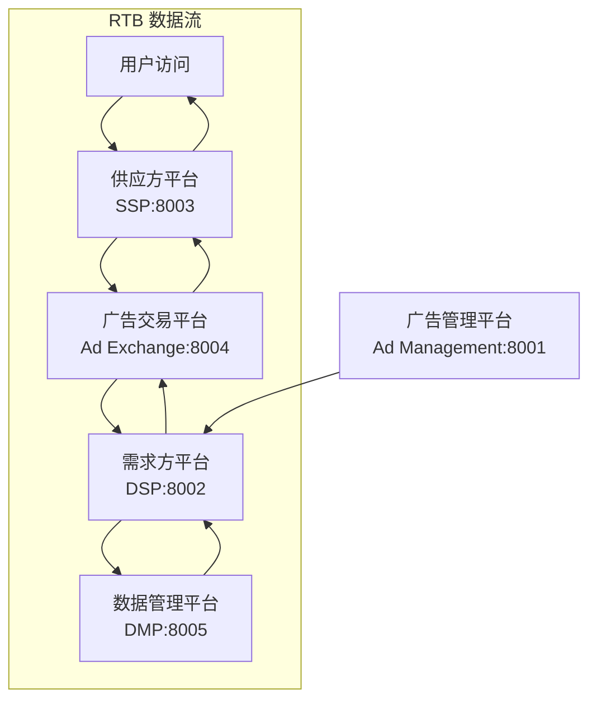

# 互联网广告系统架构演示

这是一个用于理解现代程序化广告生态系统的架构演示项目，展示了完整的实时竞价(RTB)工作流程。系统包含五个核心组件，采用微服务架构设计，支持完整的广告投放生命周期。

## 🏗️ 系统架构

### 核心组件

1. **广告管理平台 (Ad Management)** - 管理广告活动、预算和创意
2. **需求方平台 (DSP)** - 代表广告主参与实时竞价
3. **供应方平台 (SSP)** - 管理媒体方广告位库存和收益优化
4. **广告交易平台 (Ad Exchange)** - 促成DSP和SSP之间的实时竞价交易
5. **数据管理平台 (DMP)** - 管理用户画像和行为数据

### 架构图



## 📁 项目结构

```text
ad-system-architecture/
├── 📄 pyproject.toml              # 项目配置和依赖管理
├── 🐳 Dockerfile                  # Docker 容器配置
├── 🐳 docker-compose.yml          # Docker Compose 配置
├── 📁 server/                     # 服务实现
│   ├── 📁 ad-management/          # 广告管理平台服务
│   ├── 📁 dsp/                    # 需求方平台服务
│   ├── 📁 ssp/                    # 供应方平台服务
│   ├── 📁 ad-exchange/            # 广告交易平台服务
│   └── 📁 dmp/                    # 数据管理平台服务
├── 📁 shared/                     # 共享模块和工具
│   ├── 📄 models.py               # Pydantic数据模型
│   ├── 📄 utils.py                # 通用工具和辅助函数
│   ├── 📄 database.py             # 数据库连接和模型
│   ├── 📄 config.py               # 配置管理
│   └── 📄 monitoring.py           # 监控和指标收集
├── 📁 tests/                      # 测试套件
│   ├── 📄 test_*_service.py       # 各服务单元测试
│   ├── 📄 test_rtb_demo_flow.py   # RTB流程集成测试
│   ├── 📄 test_service_communication.py # 服务通信测试
│   └── 📄 test_system_integration.py # 系统集成测试
├── 📁 scripts/                    # 实用脚本
│   ├── 📄 start_services.py       # 启动所有服务
│   ├── 📄 start_single_service.py # 启动单个服务
│   ├── 📄 production_deploy.py    # 生产环境部署
│   └── 📄 init_database.py        # 数据库初始化
├── 📁 docs/                       # 文档
│   ├── 📄 deployment.md           # 部署和运行文档
│   └── 📄 api-documentation.md    # API接口文档
├── 📁 config/                     # 配置文件
│   ├── 📄 logging.conf            # 日志配置
│   └── 📄 monitoring.yml          # 监控配置
└── 📁 logs/                       # 日志文件目录
```

## 🚀 快速开始

### 方式一：本地开发环境

```bash
# 1. 克隆项目
git clone <repository-url>
cd ad-system-architecture

# 2. 安装 uv (Python 包管理器)
pip install uv

# 3. 安装项目依赖
uv sync

# 4. 初始化数据库
python scripts/init_database.py

# 5. 启动所有服务
python scripts/start_services.py
```

### 方式二：Docker 容器化部署

```bash
# 使用 Docker Compose 启动所有服务
docker-compose up -d

# 查看服务状态
docker-compose ps

# 查看日志
docker-compose logs -f
```

### 方式三：单容器部署

```bash
# 启动单容器模式（所有服务在一个容器中）
docker-compose --profile all-in-one up -d ad-system-all
```

## 🌐 服务访问地址

| 服务 | 地址 | API 文档 | 描述 |
|------|------|----------|------|
| 广告管理平台 | http://localhost:8001 | http://localhost:8001/docs | 管理广告活动和预算 |
| 需求方平台 (DSP) | http://localhost:8002 | http://localhost:8002/docs | 实时竞价决策 |
| 供应方平台 (SSP) | http://localhost:8003 | http://localhost:8003/docs | 广告位管理和收益优化 |
| 广告交易平台 | http://localhost:8004 | http://localhost:8004/docs | RTB流程协调 |
| 数据管理平台 (DMP) | http://localhost:8005 | http://localhost:8005/docs | 用户画像管理 |

## 🎯 核心功能演示

### RTB 实时竞价演示

```bash
# 执行完整 RTB 流程演示
curl -X POST http://localhost:8004/demo/rtb-flow-simple

# 查看详细 RTB 流程
curl -X POST http://localhost:8004/demo/rtb-flow

# 查看工作流程统计
curl http://localhost:8004/demo/workflow-stats
```

### 广告活动管理

```bash
# 创建广告活动
curl -X POST http://localhost:8001/campaigns \
  -H "Content-Type: application/json" \
  -d '{
    "name": "春季促销活动",
    "advertiser_id": "advertiser_001",
    "budget": 10000.0,
    "targeting": {
      "age_range": {"min_age": 18, "max_age": 35},
      "interests": ["technology", "shopping"]
    },
    "creative": {
      "title": "春季大促销",
      "description": "全场商品8折优惠"
    }
  }'

# 查看活动详情
curl http://localhost:8001/campaigns/{campaign_id}

# 查看活动统计
curl http://localhost:8001/campaigns/{campaign_id}/stats
```

### 用户画像管理

```bash
# 获取用户画像
curl http://localhost:8005/user/{user_id}/profile

# 记录用户行为
curl -X POST http://localhost:8005/user/{user_id}/events \
  -H "Content-Type: application/json" \
  -d '{
    "events": [
      {
        "event_type": "page_view",
        "page_url": "https://example.com/products",
        "timestamp": "2024-01-01T12:00:00Z"
      }
    ]
  }'
```

## 🔧 开发和测试

### 运行测试

```bash
# 运行所有测试
python -m pytest tests/ -v

# 运行特定测试
python -m pytest tests/test_rtb_demo_flow.py -v

# 运行集成测试
python -m pytest tests/test_system_integration.py -v

# 生成测试覆盖率报告
python -m pytest tests/ --cov=shared --cov=server --cov-report=html
```

### 启动单个服务

```bash
# 启动单个服务（开发模式）
python scripts/start_single_service.py ad-exchange --debug

# 启动指定端口
python scripts/start_single_service.py dsp --port 9002
```

### 代码质量检查

```bash
# 代码格式化
black .

# 导入排序
isort .

# 代码检查
flake8 .

# 类型检查
mypy shared/ server/
```

## 📊 监控和日志

### 健康检查

```bash
# 检查所有服务健康状态
for port in 8001 8002 8003 8004 8005; do
  echo "检查端口 $port:"
  curl -s http://localhost:$port/health | jq .
done
```

### 日志查看

```bash
# 查看应用日志
tail -f logs/application.log

# 查看 RTB 流程日志
tail -f logs/rtb.log

# 查看系统日志
tail -f logs/system.log
```

### 性能监控

系统提供实时性能监控，包括：
- 服务响应时间
- RTB 流程耗时统计
- 错误率监控
- 数据库连接状态
- 系统资源使用情况

## 🚀 生产环境部署

### 使用部署脚本

```bash
# 生产环境部署
python scripts/production_deploy.py

# 使用自定义配置
python scripts/production_deploy.py --config production.json

# 跳过备份和检查
python scripts/production_deploy.py --skip-backup --skip-checks
```

### 使用 systemd 服务

```bash
# 创建 systemd 服务文件
sudo cp ad-system.service /etc/systemd/system/

# 启用并启动服务
sudo systemctl enable ad-system
sudo systemctl start ad-system

# 查看服务状态
sudo systemctl status ad-system
```

## 📚 技术栈

- **Web框架**: FastAPI (Python 3.9+)
- **包管理**: uv
- **数据存储**: SQLite (开发) / PostgreSQL (生产)
- **API通信**: RESTful HTTP APIs + httpx
- **数据验证**: Pydantic
- **异步处理**: asyncio
- **容器化**: Docker + Docker Compose
- **测试框架**: pytest + pytest-asyncio
- **监控**: 自定义监控系统
- **日志**: Python logging + 结构化日志

## 🎯 核心特性

### ✅ 完整的 RTB 工作流程
- 用户访问模拟
- 实时竞价处理
- 广告展示确认
- 数据反馈循环

### ✅ 微服务架构
- 服务独立部署
- API 网关模式
- 服务发现和注册
- 健康检查机制

### ✅ 数据持久化
- SQLite 数据库支持
- 数据模型验证
- 自动迁移脚本
- 备份和恢复

### ✅ 监控和日志
- 实时健康监控
- 性能指标收集
- 结构化日志记录
- 告警机制

### ✅ 容器化部署
- Docker 镜像构建
- Docker Compose 编排
- 生产环境配置
- 自动化部署脚本

### ✅ 测试覆盖
- 单元测试
- 集成测试
- 端到端测试
- 性能测试

## 📖 文档

- [部署和运行文档](docs/deployment.md) - 详细的部署指南
- [API 接口文档](docs/api-documentation.md) - 完整的 API 参考
- [架构设计文档](.kiro/specs/ad-system-architecture/design.md) - 系统设计说明
- [需求文档](.kiro/specs/ad-system-architecture/requirements.md) - 功能需求说明

## 🤝 贡献指南

1. Fork 项目
2. 创建功能分支 (`git checkout -b feature/AmazingFeature`)
3. 提交更改 (`git commit -m 'Add some AmazingFeature'`)
4. 推送到分支 (`git push origin feature/AmazingFeature`)
5. 打开 Pull Request

## 📄 许可证

本项目采用 MIT 许可证 - 查看 [LICENSE](LICENSE) 文件了解详情

## 🆘 支持和帮助

- 查看 [Issues](https://github.com/your-repo/issues) 报告问题
- 查看 [Wiki](https://github.com/your-repo/wiki) 获取更多文档
- 联系开发团队获取技术支持

## 🔄 版本历史

- **v1.0.0** - 初始版本，包含完整的 RTB 演示系统
- **v1.1.0** - 添加数据持久化和监控功能
- **v1.2.0** - 增强容器化部署和生产环境支持

---

**注意**: 这是一个演示项目，用于学习和理解程序化广告系统架构。在生产环境中使用时，请根据实际需求进行安全加固和性能优化。
